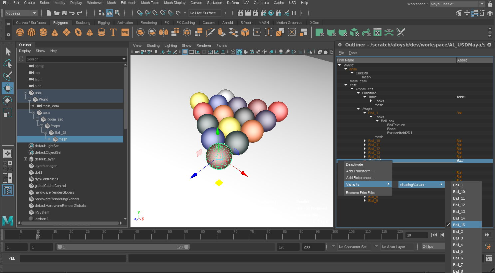

# End to End Tutorial

Please first follow USD's End to End tutorial there: https://graphics.pixar.com/usd/docs/End-to-End-Example.html

This tutorial is an extension of the original USD End to End example tutorial, we will assume that you have followed it and understand the concepts described there.
This tutorial will show how AL_USDMaya can be used to animate the "shot" in 2 different ways: using a regular maya rig with a bake process (similar to how one would use the Alembic exporter to bake a geometry cache out of maya), and the other way which allows a more USD-native process whereby we store Maya's transform modifications in a USD layer.


## Preparation

First follow the original tutorial, or you can run these steps directly:
```bash
python scripts/create_asset.py Ball --shadingVariantLayer -o models/Ball -f
python scripts/create_asset.py Table -o models/Table -f

cp assets/Ball/Ball.maya.usd models/Ball/Ball.maya.usd
cp assets/Table/Table.maya.usd models/Table/Table.maya.usd
cp -r assets/Ball/tex/ models/Ball/

python tutorial_scripts/add_shadingVariants.py -f

python tutorial_scripts/create_Room_set.py -f

python scripts/create_shot.py s00 -o shots/s00 -b ../../assets/shot.usd -f
python scripts/create_shot.py s00_01 -o shots/s00_01 -b ../s00/s00.usd -f
python tutorial_scripts/add_set_to_s00.py -f
```


## Layout

Now we are ready to do some layout on the shot, using AL_USDMaya layer editing features.

Open Maya and paste this python code in the script editor:
```py
import maya
import os
from pxr import Sdf

ASSET_BASE = os.getcwd()

def LoadStage():
    if not maya.cmds.pluginInfo('AL_USDMayaPlugin', l=True, q=True):
        maya.cmds.loadPlugin('AL_USDMayaPlugin')
    stageFile = os.path.join(ASSET_BASE, 'shots/s00_01/s00_01.usd')
    if not os.path.exists(stageFile):
        raise RuntimeError('File not found: %s'%stageFile)
    maya.cmds.AL_usdmaya_ProxyShapeImport(f=stageFile, name='shot')

def GetStage():
    from AL import usdmaya
    stageCache = usdmaya.StageCache.Get()
    stages = stageCache.GetAllStages()
    if stages:
        return stages[0]
    else:
        raise RuntimeError('No stage loaded in AL_USDMaya!')

def GetLayoutLayer():
    stage = GetStage()
    layoutLayerFilePath = os.path.join(ASSET_BASE, 'shots/s00_01/s00_01_layout.usd')

    # we use Sdf, a lower level library, to obtain the 'layout' layer.
    workingLayer = Sdf.Layer.FindOrOpen(layoutLayerFilePath)
    assert stage.HasLocalLayer(workingLayer)
    return workingLayer
    
def SetCurrentEditTarget():
    maya.cmds.AL_usdmaya_LayerCurrentEditTarget('shot', layer=GetLayoutLayer().identifier, findByIdentifier=True)

def OpenOutliner():
    import usdqt.app
    stage = GetStage()
    dialog = usdqt.app.UsdOutliner(stage)
    dialog.show()
    return dialog

def AnimateCamera():
    maya.cmds.setAttr("main_cam.readAnimatedValues", 1)
    maya.cmds.currentTime(1)
    maya.cmds.select('main_cam')
    maya.cmds.move(5, 121, 61)
    maya.cmds.rotate(-30, 5, 0)
    maya.cmds.setKeyframe('main_cam.translate')
    maya.cmds.setKeyframe('main_cam.rotate')
    
    maya.cmds.currentTime(10)
    maya.cmds.move(0, -1, 0, r=True)
    maya.cmds.rotate(0, -10, 0, r=True)
    maya.cmds.setKeyframe('main_cam.translate')
    maya.cmds.setKeyframe('main_cam.rotate')

def ExportLayoutAnimation():
    layer = GetLayoutLayer()
    for i in xrange(1, 11):
        maya.cmds.currentTime(i)
    layer.Export(os.path.join(ASSET_BASE, 'shots/s00_01/s00_01_layout.usd'))


maya.cmds.file(f=True, new=True)
LoadStage()
SetCurrentEditTarget()
AnimateCamera()
```

At this point you can also select USD geometry in the maya viewport and move it around

If you have Luma Pictures' usd-qt-components package available, you can inspect the stage and manipulate USD state directly
```py
dlg = OpenOutliner()
```
With this dialog open you can also enable/disable prims, and change variants using an interactive workflow, all changes will be saved in the layout layer.



To export the layout layer run this:
```py
ExportLayoutAnimation()
```

## Animation

Add an additional asset: the maya rig for the ball (a very very simple rig...)

```bash
cp assets/Ball/Ball_rig.ma models/Ball/Ball_rig.ma
```

Generate a shot USD that uses the ball rig using AL_USDMaya's ALMayaReference custom schema:
```
python tutorial_scripts/prep_anim_shot_s00_01.py
```

The camera and the modifications done to the layout layer should be visible in the animation scene.

Open maya, paste the following python script in the script editor:
```python
import maya
import os
from pxr import Sdf

ASSET_BASE = os.getcwd()

def LoadStage():
    if not maya.cmds.pluginInfo('AL_USDMayaPlugin', l=True, q=True):
        maya.cmds.loadPlugin('AL_USDMayaPlugin')
    stageFile = os.path.join(ASSET_BASE, 'shots/s00_01/s00_01.usd')
    if not os.path.exists(stageFile):
        raise RuntimeError('File not found: %s'%stageFile)
    maya.cmds.AL_usdmaya_ProxyShapeImport(f=stageFile, name='shot')

def GetStage():
    from AL import usdmaya
    stageCache = usdmaya.StageCache.Get()
    stages = stageCache.GetAllStages()
    if stages:
        return stages[0]
    else:
        raise RuntimeError('No stage loaded in AL_USDMaya!')

def AnimateCue():
    maya.cmds.AL_usdmaya_ChangeVariant('shot', pp='/World/anim', vs='animVariant', v='rig')
    maya.cmds.currentTime(1)
    maya.cmds.select('cueball_rig:ball_ctrl')
    maya.cmds.move(0, 77, 0, r=True)
    maya.cmds.setKeyframe('|shot|World|anim|CueBall|cueball_rig:ball_ctrl.translate')
    maya.cmds.currentTime(10)
    maya.cmds.move(14, 0, -7, r=True)
    maya.cmds.setKeyframe('|shot|World|anim|CueBall|cueball_rig:ball_ctrl.translate')

def ExportCueAnimation():
    maya.cmds.select('cueball_rig:Ball')
    maya.cmds.AL_usdmaya_ExportCommand(f=os.path.join(ASSET_BASE, 'shots/s00_01/s00_01_animcue_tmp.usd'), selected=True, frameRange=(1,10))
    os.rename('shots/s00_01/s00_01_animcue_tmp.usd', 'shots/s00_01/s00_01_animcue.usd') # temp workaround for limitation in ExportCommand to override existing layer

maya.cmds.file(f=True, new=True)
LoadStage()
AnimateCue()
ExportCueAnimation()

```

