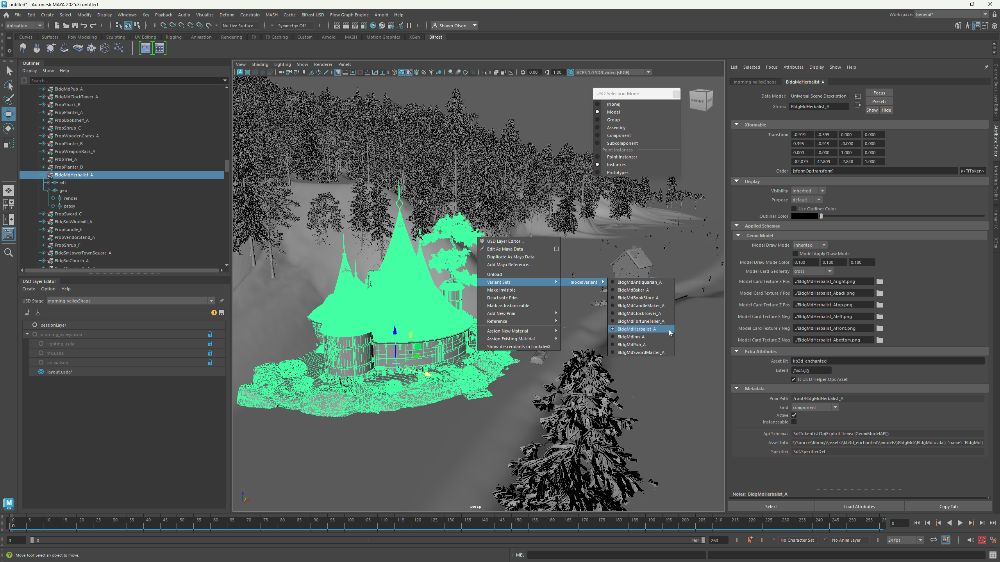

# Maya USD Plugin
**maya-usd** is a feature-rich plugin for Maya that provides support for [OpenUSD](http://openusd.org/) as part of [AOUSD](https://aousd.org/).  Evolving from two powerful plugins, MayaUSD benefited from many contributions from Pixar and Animal Logic.  While the plugin provides traditional methods for import and export, the most important and exciting capability it provides is to load USD stages directly in the viewport for interactive editing without import/export.  The plugin provides advanced integration into Maya, including the viewport, Outliner and Attribute Editor.

The USD plugin for Maya extension lets you create, edit, work in, work with and collaborate on USD data, while enabling data to move between products (ie. Maya and 3ds Max). By enabling USD data to flow in and out of Maya, you can take advantage of the following key benefits of USD: supporting DCC-agnostic pipelines/workflows and enabling non-linear collaboration. The USD features can be used as a modern cross-DCC referencing pipeline that can enhance, and in many use-cases, replace existing referencing setups.

The plugin comes with a powerful API to allow extending the default import and export process and also to manipulate USD data directly via *C++ and Python*.

## Features
- Import and Export text and Binary USD formats
- Open a USD Stage directly for editing
- Edit USD data as Maya
- [Maya Reference for animation and cache workflows](https://www.youtube.com/watch?v=XW9Pu2ep-kM)
- [Layer Editor](https://help.autodesk.com/view/MAYAUL/2025/ENU/?guid=GUID-4FAD73CA-E775-4009-9DCB-3BC6792C465E)
- USD Cameras
- USD Lights
- Custom Schemas
- [Edit Routing](doc/EditRouting.md) that provides a powerful authoring environment
- Connection to [BifrostUSD](https://help.autodesk.com/view/MAYAUL/2025/ENU/?guid=Bifrost_MayaPlugin_bifrost_usd_in_maya_html) providing a procedural environment for USD authoring and editing.
- Material editing via [LookdevX](https://help.autodesk.com/view/MAYAUL/2025/ENU/?guid=LookdevX_LookdevX_for_Maya_Working_with_USD_for_Material_Authoring_html)
- Rendering support provided by [Arnold](https://github.com/Autodesk/arnold-usd) and [Maya-Hydra](https://github.com/Autodesk/maya-hydra)

## Install MayaUSD
Installers for MayaUSD can be found [here](https://github.com/Autodesk/maya-usd/releases).  Currently the plugins supports the following version of Maya
- 2022
- 2023
- 2024
- 2025
- 2026

## Plugin Documentation
+ [Getting Started with USD in Maya 2022](https://help.autodesk.com/view/MAYAUL/2022/ENU/?guid=GUID-36CFE2C3-766F-4B00-8464-E94F95E7AF4B)
+ [Getting Started with USD in Maya 2023](https://help.autodesk.com/view/MAYAUL/2023/ENU/?guid=GUID-36CFE2C3-766F-4B00-8464-E94F95E7AF4B)
+ [Getting Started with USD in Maya 2024](https://help.autodesk.com/view/MAYAUL/2024/ENU/?guid=GUID-36CFE2C3-766F-4B00-8464-E94F95E7AF4B)
+ [Getting Started with USD in Maya 2025](https://help.autodesk.com/view/MAYAUL/2025/ENU/?guid=GUID-36CFE2C3-766F-4B00-8464-E94F95E7AF4B)
+ [Getting Started with USD in Maya 2026](https://help.autodesk.com/view/MAYAUL/2026/ENU/?guid=GUID-36CFE2C3-766F-4B00-8464-E94F95E7AF4B)

## Building
Everything needed to build maya-usd is provided in the form of source and a devkit that needs to be installed.  Unit tests are provided for all projects and can be optionally built and executed using google tests. Full details on how to build and test maya-usd can be found in [BUILD.md](doc/build.md)

## Contributions
We welcome your contributions to enhance and extend the toolset.  Please visit [CONTRIBUTING.md](doc/CONTRIBUTING.md) for further information and please make yourself familiar with the [code guidelines](doc/codingGuidelines.md) for maya-usd.

## Security
We take security serious at Autodesk and the same goes for our open source contributions.  Our guidelines are documented [here](SECURITY.md)

## Developer Documentation
### Core Modules
+ [Common Plug-in Base Commands](lib/mayaUsd/commands/Readme.md)
+ [Managing Translation (Import/Export) Options](lib/mayaUsd/fileio/doc/Managing_export_options_via_JobContext_in_Python.md)
+ [Example Import and Export Plugin in Python](tutorials/import-export-plugin/README.md)
+ [Example Import and Export Plugin in C++](tutorials/import-export-plugin-c++/README.md)
+ [Adding new import or export option](lib/mayaUsd/fileio/doc/How-to-add-new-option.md)
+ [SchemaAPI Translators](lib/mayaUsd/fileio/doc/SchemaAPI_Import_Export_in_Python.md)
+ [UFE Transform](lib/usdUfe/ufe/trf/UsdTransform3d.md)
+ [Undo/Redo Support](lib/mayaUsd/undo/README.md)
+ [MaterialX](doc/MaterialX.md)
+ [MaterialX Code Gen](lib/mayaUsd/render/MaterialXGenOgsXml/README.md)
+ [Layer Saving](lib/mayaUsd/nodes/Layer_Saving_Docs.md)
+ [Edit Routing](doc/EditRouting.md)
+ [Maya Reference Edit Router](lib/usd/translators/mayaReferenceEditRouter.md)
+ [Layer Locking](doc/LayerLocking.md)
+ [Attribute Editor (AE) Template](lib/mayaUsd/resources/ae/usdschemabase/Attribute-Editor-Template-Doc.md)
+ [Hydra for Maya](https://github.com/Autodesk/maya-hydra/blob/dev/README.md)

## Additional Information

+ [License](doc/LICENSE.md)
