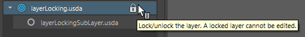
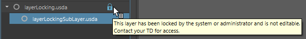
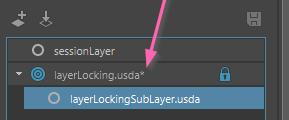
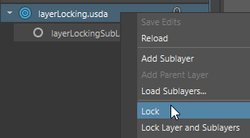
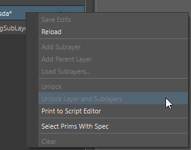

# Layer Locking

## What is layer locking?

Layer locking is a collection of commands and UI actions that allows changing
editing and saving permissions on layers of a stage.

It was designed to provide various levels of controls based on the user's interaction:
- Through the Maya USD Layer Editor
- Through commands (C++, Python and MEL)

## What are the types of locks?

There are three types of locks on a layer:
- `Unlocked`: When a layer is allowed to both be edited and saved.
- `Locked` (Edit is Locked): When a layer is allowed to be saved but not allowed to be edited.
- `System-Locked` (Edit and Save are locked): When a layer is not allowed to be saved or edited.

Changing the lock states will perform the following on a layer:
- Calls OpenUSD's [SetPermissionToSave / SetPermissionToEdit](https://openusd.org/release/api/class_sdf_layer.html#a32ad22bde9522ec46ef46ce2b88dfd14)
- Stores the current state of `Locked` and `System-Locked` in LayerLocking.h 
- In case of `Locked`, the list of locked layers are also stored in an attribute on the associated proxy shape. This allows retaining the lock state between Maya sessions if the Maya scene is saved.

### USD Layer Editor
- Through action icons on each layer item. Note that the lock button can only be interacted
if the layer isn't already locked as a System-Lock.

A locked layer appears with a blue lock icon:

A system-locked layer appears similar to a locked layer but it cannot be unlocked through the user interface:

However, if there are already changes on the layer that are unsaved, they are indicated with an asterisk (*)
but still are not counted towards saving:

The lock state can also be changed through context menu items:

Similar to the lock button, some of the operations aren't allowed for a system locked layer:

Note that there are other factors that may prevent a layer from getting saved or edited:

- If a layer is locked, it cannot be edited
- If a layer is anonymous and its parent layer is locked, the anonymous layer can be edited but cannot be saved.
This is because by saving an anonymous layer, the layer identifier changes which has to be updated on the parent layer. 
- If a layer belongs to an Un-shared stage.

Similarly, layers that are locked cannot have new sublayers as that will require changing the locked parent.

### Disk Write Permissions

Each layer is automatically checked for disk write permissions which may apply or remove a System-lock on a layer(s). These are the conditions a disk write check occurs (aka Refresh Sytem Lock):

- When the user initiates a layer reload (through the context menu in the USD Layer Editor).
- When the user initiates a stage reload (through Attribute Editor).
- When the user loads a stage from a file.
- Anything that may cause a session stage change on the LayerTreeModel (including the case of stage reload).
- Using script with the command `refreshSystemLock`.

When evaluating the disk write permissions, files for which the user has no write access will win against user-initiated locks.
For example:

| Condition | Result  |
|:--------- |:------- |
| if a layer has a user-initiated lock and the file on disk is locked | the layer becomes system-locked |
| if a layer is locked and the file on disk is unlocked | The layer will be unlocked |
| if a layer is system-locked and the file on disk is unlocked | The layer will be unlocked |

Sometimes there may be a need to re-lock the layers after a refreshSystemLock. There is a callback system that will notify through scripting when a system lock refresh occurs and modifies layer permissions.
      
## API for Layer Locking

A layer's lock state can be changed through C++ or Python.

### C++

#### Directly using MayaUsd::lockLayer `(Not Un-doable)`:

    MayaUsd::lockLayer(proxyShapePath, layer, locktype, updateProxyShapeAttr);

### Using MayaCommandHook::lockLayer `(Un-doable)`:
This uses the underlying `mayaUsdLayerEditor` MEL command.

    MayaCommandHook::lockLayer(usdLayer, lockState, includeSubLayers);

### Using MEL or Python scripts:

#### In MEL Script layer editor command `(Un-doable)`:
These commands are un-doable

    // Lock Type: 0 = Unlocked, 1 = Locked and 2 = System-Locked. 
    // Include Sublayers : 0 = Top Layer Only, 1 : Top and Sublayers
    mayaUsdLayerEditor -edit -lockLayer 0 0 "proxyShapePath" "layerIdentifier"
    
    // example: locks an anonymousLayer1 without changing the lock state of its sublayers
    mayaUsdLayerEditor -edit -lockLayer 1 0 "|PathTo|proxyShape" "anon:00000143164533E0:anonymousLayer1"
    
    // example: locks an exampleLayer.usda as well as its sub-layers
    mayaUsdLayerEditor -edit -lockLayer 1 1 "|stage|stageShape1" "d:/Assets/exampleLayer.usda"
    
    // example: System-locks an exampleLayer.usda
    mayaUsdLayerEditor -edit -lockLayer 2 0 "|stage|stageShape1" "d:/Assets/exampleLayer.usda"

For more info on the syntax please refer to [Layer Editor Command Flags](../lib/mayaUsd/commands/Readme.md#layereditorcommand)

#### In Python script `(Un-doable)`:

    # example: System-locks an exampleLayer
    cmds.mayaUsdLayerEditor(exampleLayer.identifier, edit=True, lockLayer=(2, 0, proxyShapePath))
    
### Disk Write Permission Check (RefreshSystemLock)

#### In C++ `(Un-doable)`:
This can be done by calling the following function which uses a MEL script to call `mayaUsdLayerEditor refreshSystemLock`.

    MayaCommandHook::refreshLayerSystemLock(usdLayer, refreshSubLayers);

#### In MEL script `(Un-doable)`:

    // 0 = Only top layer, 1 = Include the sublayers
    // example: This will perform a write permission check on a layer:
    mayaUsdLayerEditor -edit -refreshSystemLock "|stage|stageShape1" 0 "d:/Assets/exampleLayer.usda"
    
    // example: This will perform a write permission check on a layer and its sub-layers
    mayaUsdLayerEditor -edit -refreshSystemLock "|stage|stageShape1" 1 "d:/Assets/exampleLayer.usda"

#### In Python script `(Un-doable)`:
    
    // example: This will perform a write permission check on a layer and its sub-layers
    cmds.mayaUsdLayerEditor(topLayer.identifier, edit=True, refreshSystemLock=(proxyShapePath, 1))
    
Note that if there isn't a change in the write permissions, no actions are taken. In order to track the changes due to system-lock refresh, you can use `mayaUsd.lib.registerUICallback` to get notified about the system lock changes due to refreshSystemLock:

    def refreshSystemLockCallback(context, callbackData):
        # Get the proxy shape path
        proxyShapePath = context.get('proxyShapePath')
        # Get the list of affected layers
        layerIds = callbackData.get('affectedLayerIds')
        print("The layers with a change in lock status are:")
        for layerId in layerIds:
            print(layerIds)

    mayaUsd.lib.registerUICallback('onRefreshSystemLock', exampleCallback)

