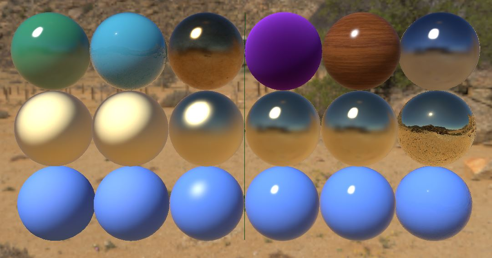
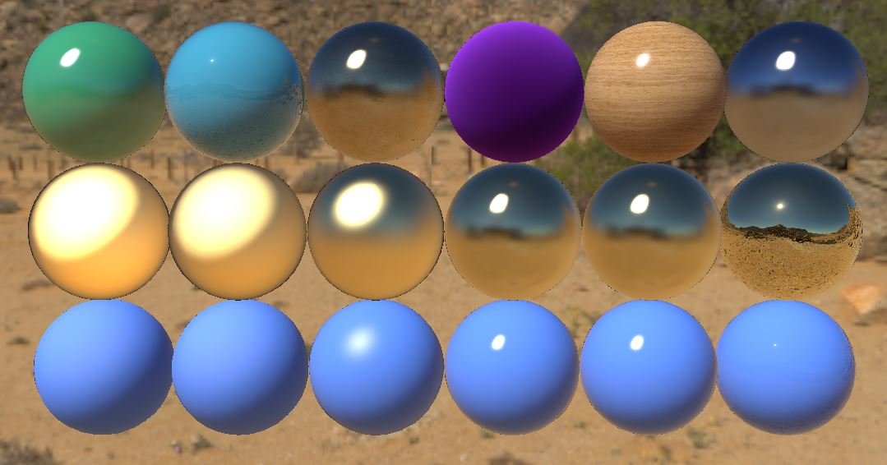

# MaterialX

Support for MaterialX in MayaUSD

## Support level

Support for MaterialX in Maya USD is based on USD support provided by the usdMtlx and hdMtlx modules.

This means we use a UsdShade translation of the MaterialX graph as transport mechanism.

## Export

We currently support exporting to MaterialX-compatible UsdShade networks:

- Standard surface shader nodes
- USD Preview Surface shader nodes
- File texture nodes
    - Connections to color components and alpha/luminance
    - Normal maps
    - Custom color spaces

### Not supported:

- Lambert, Blinn, and Phong shader nodes
- MaterialXSurface shader nodes from MaterialX Maya contrib

### To enable:

Two options:
- Install MayaUSD v0.16.0
- Rebuild tip of MayaUSD repo using a MaterialX-enabled build of USD

## Import

We can import MaterialX networks.
- UsdShade networks consisting of MaterialX nodes used for shading in the `mtlx` render context
- `.mtlx` files referenced in a USD stage as converted by the `usdMtlx` plugin in USD

### Not supported:

- MaterialX networks containing surface shaders other than standard surface or preview surface
- MaterialX networks containing unexpected procedural nodes
- Importing to MaterialXSurface shader nodes

### To enable:

Two options:
- Install MayaUSD v0.16.0
- Rebuild tip of MayaUSD repo using a MaterialX-enabled build of USD

## USD stage support in viewport

We support rendering a MaterialX USD asset directly in the VP2 viewport.

### Supported:

We are using the hdMtlx translation framework, which is also in use for hdStorm and hdPrman, and using the same GLSL code generator as hdStorm, so valid USD MaterialX material graphs should display correctly.

Maya spheres with standard surface shading: 


The same spheres exported with MaterialX shading and loaded as a USD stage: 

### Not supported:

- DirectX 11 viewport
- [Issue 1523](https://github.com/PixarAnimationStudios/USD/issues/1523): Color spaces
- [Issue 1538](https://github.com/PixarAnimationStudios/USD/issues/1538): MaterialX networks containing surface shaders other than standard surface or preview surface

### To enable:

Two options:
- Install MayaUSD v0.16.0 on top of Maya 2022.3 or PR132
- Rebuild tip of MayaUSD repo using a MaterialX-enabled build of USD and a supported Maya version

Once the updated plugin is in use, the viewport will automatically select MaterialX shading over UsdPreviewSurface shading if the referenced USD stage contains MaterialX shading networks.

### Building a MaterialX-enabled USD compatible with MayaUSD

We currently use MaterialX 1.38.3 and USD 21.11. Combining these two together requires patching USD:

```
git checkout tags/v21.11
# Fetch updates selected for next USD release
git cherry-pick 08a5644770d063fe355aff1a2069b22b84d8402a
git cherry-pick adfc04eea92b91965b0da68503539b079a5d30d9
git cherry-pick 4ac8a7e9a440695f0392a94e27db1683773fce76
```

Then you need to merge the pending MaterialX v1.38.3 update submitted as [pull request 1738](https://github.com/PixarAnimationStudios/USD/pull/1738)

Then you build USD using the `build_usd.py` script and the `--materialx` option.
