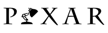
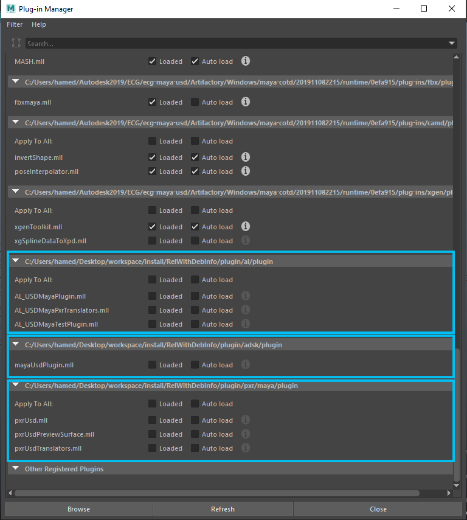

# Building

## Getting and Building the Code

The simplest way to build the project is by running the supplied **build.py** script. This script builds the project and installs all of the necessary libraries and plug-ins for you. Follow the instructions below to learn how to use the script. 

#### 1. Tools and System Prerequisites

Before building the project, consult the following table to ensure you use the recommended version of compiler, operating system, cmake, etc. 

|        Required       |    |                                           |        |
|:---------------------:|:-------------------------:|:------------------------------------------------------------:|:---------------------------:|
|    Operating System   |         Windows 10        | High Sierra (10.13)<br>Mojave (10.14)<br>Catalina (10.15)<br>Big Sur (11.2.x)    |       CentOS 7/8              |
|   Compiler Requirement| Maya 2019 (VS 2017)<br>Maya 2020 (VS 2017)<br>Maya 2022 (VS 2017/2019) | Maya 2019 (Xcode 7.3.1)<br>Maya 2020 (Xcode 10.2.1)<br>Maya 2022 (Xcode 10.2.1) | Maya 2019 (gcc 6.3.1)<br>Maya 2020 (gcc 6.3.1)<br>Maya 2022 (gcc 6.3.1/9.3.1) |
| CMake Version (min/max) |        3.13 - 3.17      |                              3.13 - 3.17                     |           3.13 - 3.17       |
|         Python        |       2.7.15 or 3.7.7     |                            2.7.15 or 3.7.7                   |        2.7.15 or 3.7.7      |
|    Python Packages    | PyYAML, PySide, PyOpenGL, Jinja2        | PyYAML, PySide2, PyOpenGL, Jinja2              | PyYAML, PySide, PyOpenGL, Jinja2 |
|    Build generator    | Visual Studio, Ninja (Recommended)    |  XCode, Ninja (Recommended)                      |    Ninja (Recommended)      |
|    Command processor  | Visual Studio X64 2017 or 2019 command prompt  |                     bash                |             bash            |
| Supported Maya Version|     2019, 2020, 2022      |                      2019, 2020, 2022                        |      2019, 2020, 2022       |

|        Optional       |    |                                           |        |
|:---------------------:|:-------------------------:|:------------------------------------------------------------:|:---------------------------:|
|          Qt           | Maya 2019 = 5.6.1<br>Maya 2020 = 5.12.5<br>Maya 2022 = 5.15.2 | Maya 2019 = 5.6.1<br>Maya 2020 = 5.12.5<br>Maya 2022 = 5.15.2 | Maya 2019 = 5.6.1<br>Maya 2020 = 5.12.5<br>Maya 2022 = 5.15.2 |

***NOTE:*** Visit the online Maya developer help document under ***Setting up your build environment*** for additional compiler requirements on different platforms.

#### 2. Download and Build Pixar USD 

See Pixar's official github page for instructions on how to build USD: https://github.com/PixarAnimationStudios/USD . Pixar has recently removed support for building Maya USD libraries/plug-ins in their github repository and ```build_usd.py```. When building the maya-usd project, it is important the recommended ```Pixar USD``` commitID or tag from the table below are used: 

|               |                |        
|:------------: |:---------------:                  |
|  CommitID/Tags | release: [v20.02](https://github.com/PixarAnimationStudios/USD/releases/tag/v20.02) or [v20.05](https://github.com/PixarAnimationStudios/USD/releases/tag/v20.05) or [v20.08](https://github.com/PixarAnimationStudios/USD/releases/tag/v20.08) or [v20.11](https://github.com/PixarAnimationStudios/USD/releases/tag/v20.11) or [v21.02](https://github.com/PixarAnimationStudios/USD/releases/tag/v21.02) or [v21.05](https://github.com/PixarAnimationStudios/USD/releases/tag/v21.05)<br> dev: [2095f6c](https://github.com/PixarAnimationStudios/USD/commit/2095f6cc5ac08b19d6a00308f33c0bbd27cffc35) |

For additional information on building Pixar USD, see the ***Additional Build Instruction*** section below.

***NOTE:*** Make sure that you don't have an older USD locations in your ```PATH``` and ```PYTHONPATH``` environment settings. ```PATH``` and ```PYTHONPATH``` are automatically adjusted inside the project to point to the correct USD location. See ```cmake/usd.cmake```.

#### 3. Universal Front End (UFE)

The Universal Front End (UFE) is a DCC-agnostic component that allows Maya to browse and edit data in multiple data models. This allows Maya to edit pipeline data such as USD. UFE comes installed as a built-in component with Maya 2019 and later. UFE is developed as a separate binary component, and therefore versioned separately from Maya. Maya 2019 and Maya 2020 both shipped with UFE **v1.0.0**. Maya 2022 shipped with UFE **v2.0.0**.

To build the project with UFE support, you will need to use the headers and libraries included in the ***Maya Devkit***:

https://www.autodesk.com/developer-network/platform-technologies/maya

***NOTE:*** UFE is only supported in Maya 2019 and later. Earlier versions of Maya should still be able to load the plug-ins but without the features enabled by UFE.

#### 4. Download the source code

Start by cloning the repository:
```
git clone https://github.com/Autodesk/maya-usd.git
cd maya-usd
```

##### Repository Layout

| Location      | Description                                                                                   |
|-------------  |---------------------------------------------------------------------------------------------  |
|     lib       | The libraries that all other plugins depend on. Will contain common utilities and features.   |
| plugin/adsk   | The Autodesk Maya plugin                                                                      |
|  plugin/pxr   | The Pixar Maya plugin                                                                         |
|  plugin/al    | The Animal Logic Maya plugin                                                                  |

#### 5. How To Use build.py Script

##### Arguments

There are four arguments that must be passed to the script: 

| Flags                 | Description                                                                           |
|--------------------   |-------------------------------------------------------------------------------------- |
|   --maya-location     | directory where Maya is installed.                                                    |
|  --pxrusd-location    | directory where Pixar USD Core is installed.                                          |
|  --devkit-location    | directory where Maya devkit is installed.                                             |
| workspace_location    | directory where the project use as a workspace to build and install plugin/libraries  |

```
Linux:
➜ maya-usd python build.py --maya-location /usr/autodesk/maya2020 --pxrusd-location /usr/local/USD-Release --devkit-location /usr/local/devkitBase /usr/local/workspace

MacOSX:
➜ maya-usd python build.py --maya-location /Applications/Autodesk/maya2020 --pxrusd-location /opt/local/USD-Release --devkit-location /opt/local/devkitBase /opt/local/workspace

Windows:
c:\maya-usd> python build.py --maya-location "C:\Program Files\Autodesk\Maya2020" --pxrusd-location C:\USD-Release --devkit-location C:\devkitBase C:\workspace
```

##### Build Arguments

| Flag                  | Description                                                                           |
|--------------------   |---------------------------------------------------------------------------------------|
|   --build-args        | comma-separated list of cmake variables can be also passed to build system.           |

```
--build-args="-DBUILD_ADSK_PLUGIN=ON,-DBUILD_PXR_PLUGIN=OFF,-DBUILD_TESTS=OFF"
```

##### CMake Options

Name                        | Description                                                | Default
---                         | ---                                                        | ---
BUILD_MAYAUSD_LIBRARY       | builds Core USD libraries.                                 | ON
BUILD_ADSK_PLUGIN           | builds Autodesk USD plugin.                                | ON
BUILD_PXR_PLUGIN            | builds the Pixar USD plugin and libraries.                 | ON
BUILD_AL_PLUGIN             | builds the Animal Logic USD plugin and libraries.          | ON
BUILD_HDMAYA                | builds the Maya-To-Hydra plugin and scene delegate.        | ON
BUILD_RFM_TRANSLATORS       | builds translators for RenderMan for Maya shaders.         | ON
BUILD_TESTS                 | builds all unit tests.                                     | ON
BUILD_STRICT_MODE           | enforces all warnings as errors.                           | ON
BUILD_WITH_PYTHON_3			| build with python 3.										 | OFF
BUILD_SHARED_LIBS			| build libraries as shared or static.						 | ON
CMAKE_WANT_UFE_BUILD        | enables building with UFE (if found).                      | ON

##### Stages

| Flag                 | Description                                                                           |
|--------------------  |--------------------------------------------------------------------------------------------------- |
|   --stages           | comma-separated list of stages can also be passed to the build system. By default "clean, configure, build, install" stages are executed if this argument is not set. |

| Options       | Description                                                                                   |
|-----------    |---------------------------------------------------                                            |
| clean         | clean build                                                                                   |
| configure     | call this stage every time a cmake file is modified                                           |
| build         | builds the project                                                                            |
| install       | installs all the necessary plug-ins and libraries                                             |
| test          | runs all (PXR,AL,UFE) unit tests                                                              |
| package       | bundles up all the installation files as a zip file inside the package directory              |

```
Examples:
--stages=configure,build,install
--stages=test
```
***NOTE:*** All the flags can be followed by either ```space``` or ```=```

##### CMake Generator

It is up to the user to select the CMake Generator of choice, but we encourage the use of the Ninja generator. To use the Ninja Generator, you need to first install the Ninja binary from https://ninja-build.org/

You then need to set the generator to ```Ninja``` and the ```CMAKE_MAKE_PROGRAM``` variable to the Ninja binary you downloaded.
```
python build.py --generator Ninja --build-args=-DCMAKE_MAKE_PROGRAM='path to ninja binary'
```
##### Build and Install locations

By default, the build and install directories are created inside the **workspace** directory. However, you can change these locations by setting the ```--build-location``` and ```--install-location``` flags. 

##### Build Log

By default the build log is written into ```build_log.txt``` inside the build directory. If you want to redirect the output stream to the console instead,
you can pass ```--redirect-outstream-file``` and set it to false.

##### Additional flags and options

Run the script with the ```--help``` parameter to see all the possible flags and short descriptions.

#### 6. How To Run Unit Tests

Unit tests can be run by setting ```--stages=test``` or by simply calling `ctest` directly from the build directory.

For example, to run all Animal Logic's tests from the command-line go into ```build/<variant>/plugin/al``` and call `ctest`.

```
➜  ctest -j 8
Test project /Users/sabrih/Desktop/workspace/build/Debug/plugin/al
    Start 4: AL_USDMayaTestPlugin
    Start 5: TestUSDMayaPython
    Start 8: TestPxrUsdTranslators
    Start 7: TestAdditionalTranslators
    Start 1: AL_MayaUtilsTests
    Start 3: Python:AL_USDTransactionTests
    Start 2: GTest:AL_USDTransactionTests
    Start 6: testMayaSchemas
1/8 Test #2: GTest:AL_USDTransactionTests .....   Passed    0.06 sec
2/8 Test #6: testMayaSchemas ..................   Passed    0.10 sec
3/8 Test #3: Python:AL_USDTransactionTests ....   Passed    0.73 sec
4/8 Test #1: AL_MayaUtilsTests ................   Passed    6.01 sec
5/8 Test #8: TestPxrUsdTranslators ............   Passed    9.96 sec
6/8 Test #5: TestUSDMayaPython ................   Passed   10.28 sec
7/8 Test #7: TestAdditionalTranslators ........   Passed   12.06 sec
8/8 Test #4: AL_USDMayaTestPlugin .............   Passed   27.43 sec
100% tests passed, 0 tests failed out of 8
```

# Additional Build Instruction

##### Python:

It is important to use the Python version shipped with Maya and not the system version when building USD on MacOS. Note that this is primarily an issue on MacOS, where Maya's version of Python is likely to conflict with the version provided by the system. 

To build USD and the Maya plug-ins on MacOS for Maya (2019, 2020, 2022), run:
```
/Applications/Autodesk/maya2019/Maya.app/Contents/bin/mayapy build_usd.py ~/Desktop/BUILD
```
By default, ``usdview`` is built which has a dependency on PyOpenGL. Since the Python version of Maya doesn't ship with PyOpenGL you will be prompted with the following error message:
```
PyOpenGL is not installed. If you have pip installed, run "pip install PyOpenGL" to install it, then re-run this script.
If PyOpenGL is already installed, you may need to update your ```PYTHONPATH``` to indicate where it is located.
```
The easiest way to bypass this error is by setting ```PYTHONPATH``` to point at your system python or third-party python package manager that has PyOpenGL already installed.
e.g
```
export PYTHONPATH=$PYTHONPATH:Library/Frameworks/Python.framework/Versions/2.7/lib/python2.7/site-packages
```
Use `pip list` to see the list of installed packages with your python's package manager.

e.g
```
➜ pip list
DEPRECATION: Python 2.7 will reach the end of its life on January 1st, 2020. Please upgrade your Python as Python 2.7 won't be maintained after that date. A future version of pip will drop support for Python 2.7.
Package    Version
---------- -------
Jinja2     2.10   
MarkupSafe 1.1.0  
pip        19.1.1 
PyOpenGL   3.1.0  
PySide2    5.12.1 
PyYAML     3.13   
setuptools 39.0.1 
shiboken2  5.12.1 
```

##### Dependencies on Linux DSOs when running tests

Normally either runpath or rpath are used on some DSOs in this library to specify explicit on other libraries (such as USD itself)

If for some reason you don't want to use either of these options, and switch them off with:
```
CMAKE_SKIP_RPATH=TRUE
```
To allow your tests to run, you can inject LD_LIBRARY_PATH into any of the mayaUSD_add_test calls by setting the ADDITIONAL_LD_LIBRARY_PATH cmake variable to $ENV{LD_LIBRARY_PATH} or similar.

There is a related ADDITIONAL_PXR_PLUGINPATH_NAME cmake var which can be used if schemas are installed in a non-standard location

##### Devtoolset-6:

Devtoolset-6, which includes GCC 6 on CentOS has been retired from the main repo and moved into the vault. Follow instructions below for installing devtoolset-6 on CentOS:

```
# download the packages, install may fail with "no public key found"
sudo yum-config-manager --add-repo=http://vault.centos.org/7.6.1810/sclo/x86_64/rh/

# to fix "no public key found"
cd /etc/pki/rpm-gpg
ls # confirm RPM-GPG-KEY-CentOS-SIG-SCLo exists
sudo rpm --import RPM-GPG-KEY-CentOS-SIG-SCLo
rpm -qa gpg* # confirm key with substring f2ee9d55 exists

# to install devtoolset-6
sudo yum install devtoolset-6

# disable the vault after successful install
sudo yum-config-manager --disable vault.centos.org_7.6.1810_sclo_x86_64_rh_
```

# How to Load Plug-ins in Maya 

The provided module file (*.mod) facilitates setting various environment variables for plugins and libraries. After the project is successfully built, ```mayaUsd.mod``` is installed inside the install directory. In order for Maya to discover this mod file, ```MAYA_MODULE_PATH``` environment variable needs to be set to point to the location where the mod file is installed.
Examples:
```
set MAYA_MODULE_PATH=C:\workspace\install\RelWithDebInfo
export MAYA_MODULE_PATH=/usr/local/workspace/install/RelWithDebInfo
```
Once MAYA_MODULE_PATH is set, run maya and go to ```Windows -> Setting/Preferences -> Plug-in Manager``` to load the plugins.

 
