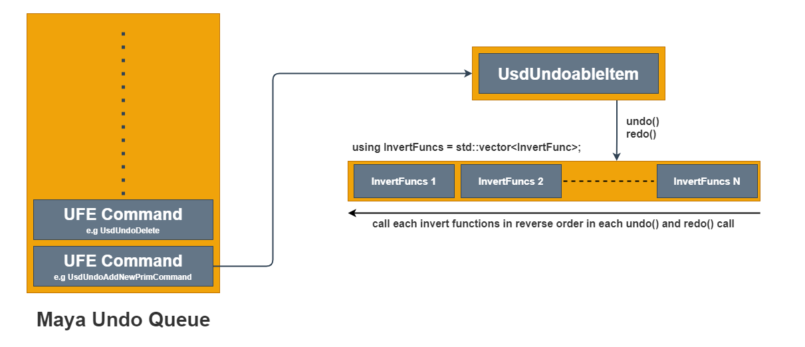

# USD Undo/Redo Support

## Motivation

The primary motivation for this service is to restore USD data model changes to it's correct state after undo/redo calls. The current implementation for this system uses [SdfLayerStateDelegateBase](https://graphics.pixar.com/usd/docs/api/class_sdf_layer_state_delegate_base.html#details) by implementing a mechanism to collect an inverse of each authoring operation for undo purposes. This mechanism was inspired by Luma's USD undo/redo facilities found in [usdQt](https://github.com/LumaPictures/usd-qt) 

## Building Blocks

#### UsdUndoManager

The primary job of UsdUndoManager is to track state changes from UsdUndoStateDelegate, collect inverse edits in every state change, and transfer collected edits into an UsdUndoableItem when required.

#### UsdUndoBlock

Similar to SdfChangeBlock concept, UsdUndoBlock collects multiple edits into a single undo operation.
Nested UsdUndoBlock are also supported but only the top level block will transfer the edits to UsdUndoableItem.

#### UsdUndoableItem

This is the object that we store in Maya's undo stack and has public interfaces for undo() and redo(). 
Both undo() and redo() internally call doInvert() which calls each inverse edit function in reverse order. Inside doInvert() call a new UsdUndoBlock object is created to collect the new edits in the next undo or redo call. A new SdfChangeBlock object is also created to batch the USD notifications changes into a single operation.

It is important to note that inverse edits are ***only collected inside the scope of UsdUndoBlock***.

#### UsdUndoStateDelegate

The state delegate is invoked on every authoring operation on a layer. This delegate is spawned via UsdUndoManager::trackLayerStates() in StagesSubject::stageEditTargetChanged() and StagesSubject::onStageSet().

## How to use Undo/Redo service inside UFE Commands

Every UFE commands (e.g add newPrim, delete, reorder, etc...) must override execute(),undo(),redo() functions.
These functions are similar to Maya command's doIt(),redoIt(),undoIt() functions. Inside execute() call, USD data model state is set for the first time. undo() and redo() can then be invoked for restoring the state. The method redo() must leave exactly the same state as execute(). Following diagram shows how a UFE command object along with its UsdUndoableItem object is placed in Maya's undo queue.

 

***NOTE:*** Currently rename, parent, group commands haven't adopted to this service yet.

##### Pseudo code in C++
``` cpp
UsdUndoableItem _undoableItem;

void UsdUndoYourCommand::undo() 
{
    _undoableItem.undo();
}

void UsdUndoYourCommand::redo()
{
    _undoableItem.redo();
}

void UsdUndoYourCommand::execute()
{
    UsdUndoBlock undoBlock(&_undoableItem);
    
    /* your usd data model changes */
}
```

## How to use Undo/Redo service outside UFE Commands ( e.g MPxCommand )

Collecting USD edits inside Maya MPxCommand happens automatically via UsdUndoBlockCmd. The idea is to execute the USD data model changes inside this object when UsdUndoBlock expires and store the invert objects in there for undo/redo purposes.

When this command executes, it will call no-op MPxCommand::doIt() which pushes the command onto the Maya undo queue, and its redoIt() and undoIt() can then be used to restore the state.

For python users, we only provide bindings for UsdUndoManager and UsdUndoBlock. The signature for calling UsdUndoBlock is slightly different than C++ in a sense that clients don't need to pass in UsdUndoableItem object as an argument.


##### Pseudo code in Python
``` python
import maya.cmds as cmds

# create a stage in memory
self.stage = Usd.Stage.CreateInMemory()

# track the layer state changes
mayaUsdLib.UsdUndoManager.trackLayerStates(self.stage.GetRootLayer())

# create undo block
with mayaUsdLib.UsdUndoBlock():
    prim = self.stage.DefinePrim('/World', 'Sphere')
    self.assertTrue(bool(prim))

#undo
cmds.undo()

#redo
cmds.redo()

```

***NOTE:*** Currently UsdUndoBlockCmd command is only registered via mayaUsd plugin.