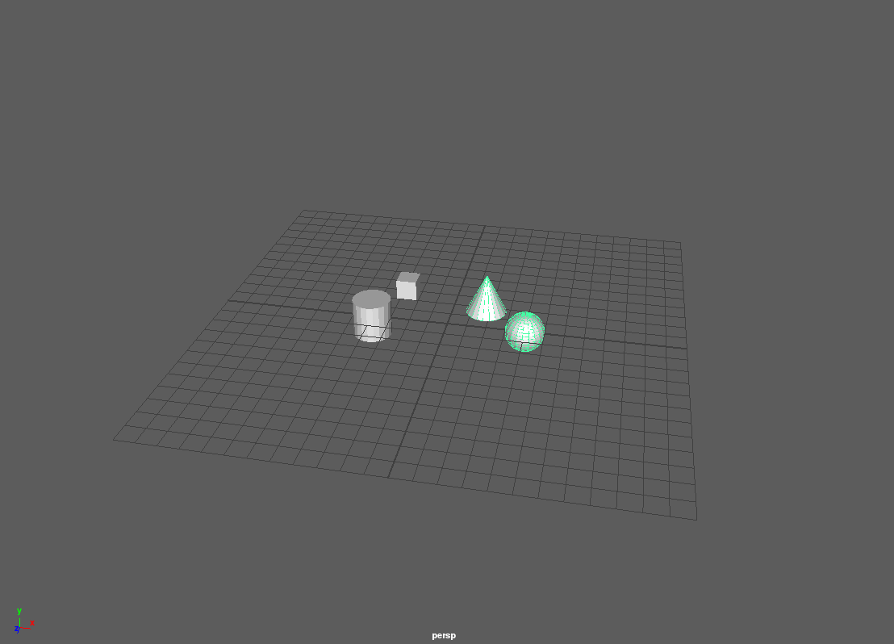
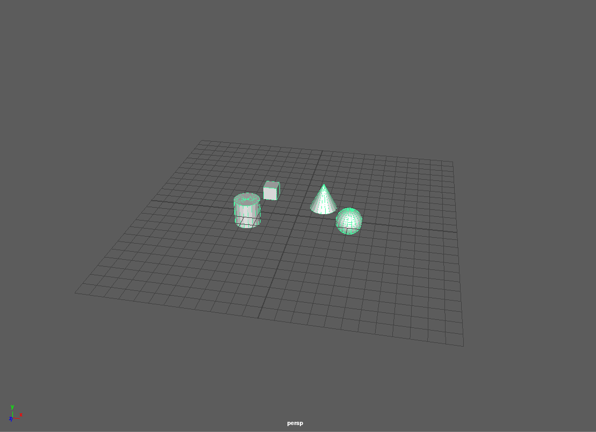

# Selectability 
Selectability is used by AL_USDMaya to determine if a prim is selectable in the Maya viewport. At Animal Logic, we disable selection on prims for certain departments to stop them from accidently selecting a prim. Selectability is computed hierarchically, meaning that a child prim inherits it's ancestors Selectability value. 

By default every prim is seletable, If any ancestor is found to be unselectable then all descendant prims are unselectable.


## Demo
The following Demo will show you how to make a Prim selectable and unselectable from the Maya viewport and show you a few different ways to get and commpute the Selectability value on a Prim.
 
Run the following commands in Maya's script editor with the AL_USDMaya plugin loaded.


***

Create a proxy shape pointing to our test file
```
cmds.AL_usdmaya_ProxyShapeImport(file="<PATH_TO_ASSETS_FOLDER_IN_THIS_DIRECTORY>/selectable_world.usda")
```

You should notice that the Sphere and the Cone are selectable, but the Cube and the Cylinder can't be selected.



***

Now lets change the selectability of the Cube so it and it's child can be selectable.

```
from AL import usdmaya
from AL.usd.schemas import maya as maya_schemas
stageCache = usdmaya.StageCache.Get()
stage = stageCache.GetAllStages()[0]
cube = stage.GetPrimAtPath("/root/cube")

cubeApi = maya_schemas.ModelAPI(cube)
cubeApi.SetSelectability(maya_schemas.Tokens.selectability_selectable)
```
The cube and it's children are now Selectable.



***

Now lets turn off selectability on everything by making the root node unselectable!
```
root = stage.GetPrimAtPath("/root")
rootApi = maya_schemas.ModelAPI(root)
rootApi.SetSelectability(maya_schemas.Tokens.selectability_unselectable)
```

***

To determine the selectability of a prim you can use the ModelAPI::ComputeSelectability method

```
s = cubeApi.ComputeSelectability()

if(s != maya_schemas.Tokens.selectability_unselectable):
  print "The Cone's selectable!"
```

You can also determine the prim's direct selectability value by calling ModelAPI::GetSelectability
```
print "The Cone's selectability metadata value is '{}'".format(cubeApi.GetSelectability())
```
