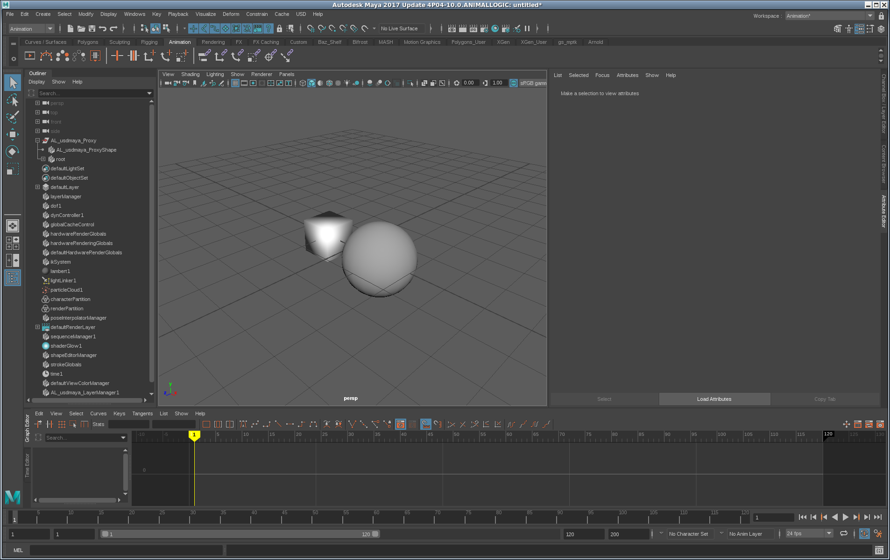

# Mesh Translation
Mesh Translation is the act of moving the Mesh information from USD/Hydra to Maya then back to USD/Hydra. Once your geometry is in Maya you are then able to use all of Maya's geometry manipulation tools as you would normally.

By default the Mesh typed prim's geometry is not translated into Maya when importing via the ProxyShape, so to import the mesh into Maya you must run the `AL_usdmaya_TranslatePrim` command

The following will demonstrate the process of importing a scene, modifying some geometry and saving it out to a layer.

## Demo
 
Run the following commands in Maya's script editor with the AL_USDMaya plugin loaded.

Create a proxy shape pointing to our test file:

```
cmds.AL_usdmaya_ProxyShapeImport(file="<PATH_TO_tutorialAssets_FOLDER>/primitive_world.usda")
```

In your scene you should have a few primitive shapes, all are currently rendered outside of Maya by Pixar's Hydra renderer.


Now force the translation of the Sphere's Mesh prim into Maya using the `ip`(importPrim) and the `fi`(force import). The `fi` flag is needed because the MeshTranslator is flagged to not automatically import when a prim is found either during a variant switch or loading the scene.

```
# Python script editor
from maya import cmds

# Instead of using this select command you can pass the name of the proxy shape into -p
cmds.select(cmds.listRelatives(cmds.ls(type="AL_usdmaya_ProxyShape")[0], p=True))

# force the translator to import the prim into Maya the specified path
cmds.AL_usdmaya_TranslatePrim(fi=True, ip="/root/sphere")

cmds.select(clear=True)
```

You can also import multiple prims by passing in comma seperated prim paths

```
cmds.AL_usdmaya_TranslatePrim(fi=True, ip="/root/sphere,/root/cube")
```





Modify the the sphere's geometry by moving around some vertices or by scaling it like I did, then call the command again with the teardown parameter instead, this will trigger the writing of the modifications to the geometry out to the current EdiTarget

```
from AL import usdmaya
from AL.usd import schemas
stageCache = usdmaya.StageCache.Get()
stage = stageCache.GetAllStages()[0]

# Set the EditTarget to be the SessionLayer,
stage.SetEditTarget(stage.GetSessionLayer())
# Instead of using this select command you can pass the name of the proxy shape into -p
cmds.select(cmds.listRelatives(cmds.ls(type="AL_usdmaya_ProxyShape")[0], p=True))

# trigger the teardown of the prim at the specified path
cmds.AL_usdmaya_TranslatePrim(tp="/root/sphere")

cmds.select(clear=True)
```

Now you should notice the Sphere is back being rendered by Hydra and that the session layer has modifications in it.

You can also teardown multiple prims by passing in comma seperated prim paths

```
cmds.AL_usdmaya_TranslatePrim(td="/root/sphere,/root/cube")
```


***
